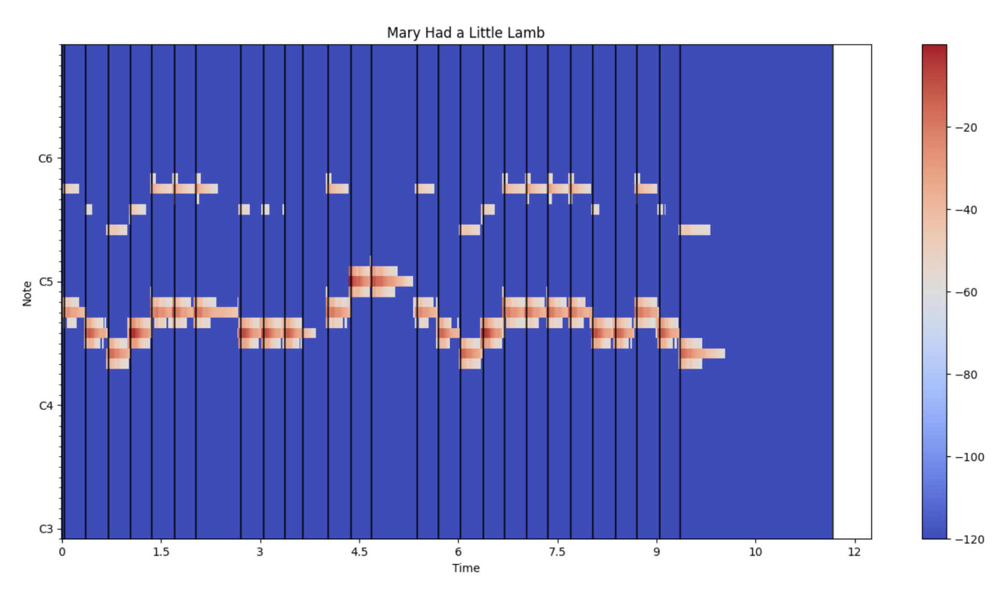
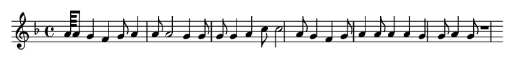

# Song to Sheet Music Converter

This project is designed to convert audio files of songs (specifically musical instruments such as piano and violin) into sheet music notation.

## Libraries used

librosa, music21, sklearn, numpy, matplotlib, mutagen

## Features

- Audio to MIDI Conversion: Uses librosa to convert audio files (in formats supported by mutagen) into MIDI representation
- Note Detection: Uses music21 to analyze MIDI data and detect musical notes and their durations
- Instrument Detection: Uses sklearn to detect the instrument in the audio file (blueprint)
- Sheet Music Generation: Uses music21 to generate sheet music notation from detected notes
- Visualization: Uses matplotlib to visualize the notes of the original audio

# Output

One example of the usage and output.

<strong>Audio Input<strong>: An mp3 of me playing Mary Had a Little Lamb on the Piano

<strong>Note Frequency to Time graph (using matplotlib)<strong>


<strong>music21 Music Score in Text<strong>

```bash
{0.0} <music21.metadata.Metadata object at 0x22e7e9c4bd0>
{0.0} <music21.instrument.Piano 'piano'>
{0.0} <music21.tempo.MetronomeMark maestoso Quarter=90>
{0.0} <music21.key.Key of F major>
{0.0} <music21.note.Note A>
{0.0625} <music21.note.Note A>
{0.5625} <music21.note.Note G>
{1.5625} <music21.note.Note F>
{2.5625} <music21.note.Note G>
{3.0625} <music21.note.Note A>
{4.0625} <music21.note.Note A>
{4.5625} <music21.note.Note A>
{6.5625} <music21.note.Note G>
{7.5625} <music21.note.Note G>
{8.0625} <music21.note.Note G>
{8.5625} <music21.note.Note G>
{9.5625} <music21.note.Note A>
{10.5625} <music21.note.Note C>
{11.0625} <music21.note.Note C>
{13.0625} <music21.note.Note A>
{13.5625} <music21.note.Note G>
{14.5625} <music21.note.Note F>
{15.5625} <music21.note.Note G>
{16.0625} <music21.note.Note A>
{17.0625} <music21.note.Note A>
{17.5625} <music21.note.Note A>
{18.5625} <music21.note.Note A>
{19.5625} <music21.note.Note G>
{20.5625} <music21.note.Note G>
{21.0625} <music21.note.Note A>
{22.0625} <music21.note.Note G>
{22.5625} <music21.note.Rest whole>
```

<strong>Final Sheet Music Output<strong>


