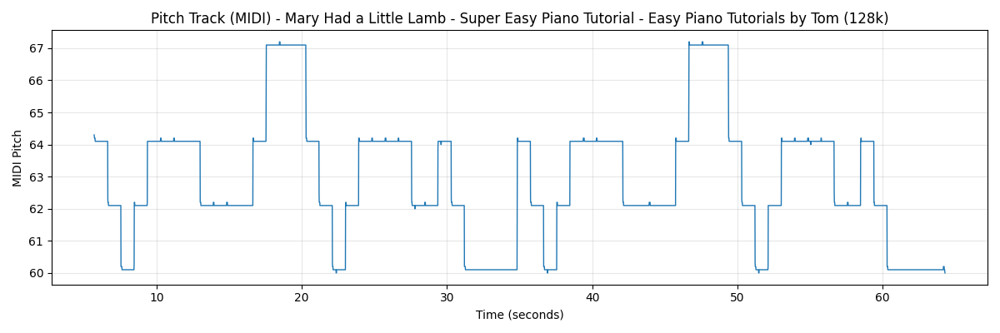
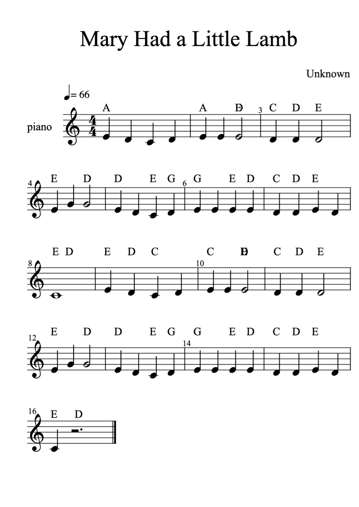

## Demo

*Mary Had a Little Lamb* — single staff, 90 BPM, detected key **C major**

**Input:** [mary-had-a-little-lamb.mp3](docs/demo/mary-had-a-little-lamb.mp3)

| Pitch detection | Sheet music |
|---|---|
|  |  |

**Output:** [mary-had-a-little-lamb.pdf](docs/demo/mary-had-a-little-lamb.pdf)

All demo files live in [`docs/demo/`](docs/demo/).

## Run locally

**Prerequisites:** Python 3.11+, Node 20+

```bash
make setup      # once
make backend    # terminal 1 → http://localhost:8000
make frontend   # terminal 2 → http://localhost:3000
```

**Modes:** Single staff (pYIN, simple melodies) · Grand staff (Basic Pitch, piano/polyphonic)

**Optional — isolate piano from mixed audio:**
```bash
source .venv/bin/activate && pip install -r requirements-ml.txt
brew install ffmpeg   # if needed
```
Then check "Isolate piano" in the UI (Grand staff mode).

## Tests

```bash
make test    # unit + baseline tests
make eval    # MIR evaluation report → docs/EVALUATION.md
```

## License

Apache 2.0 components: [Spotify Basic Pitch](https://github.com/spotify/basic-pitch).
