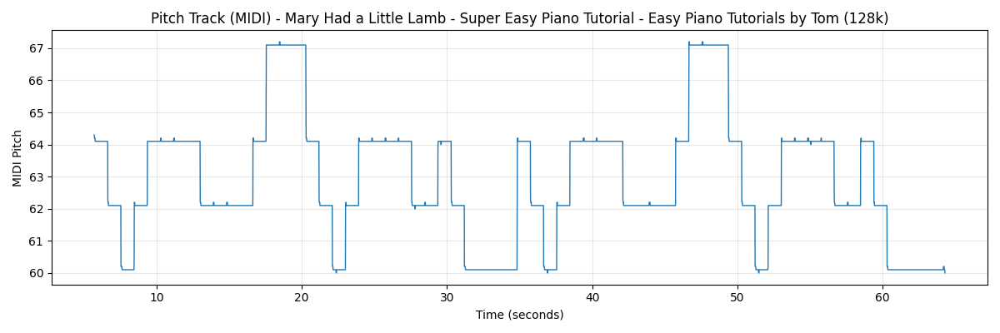
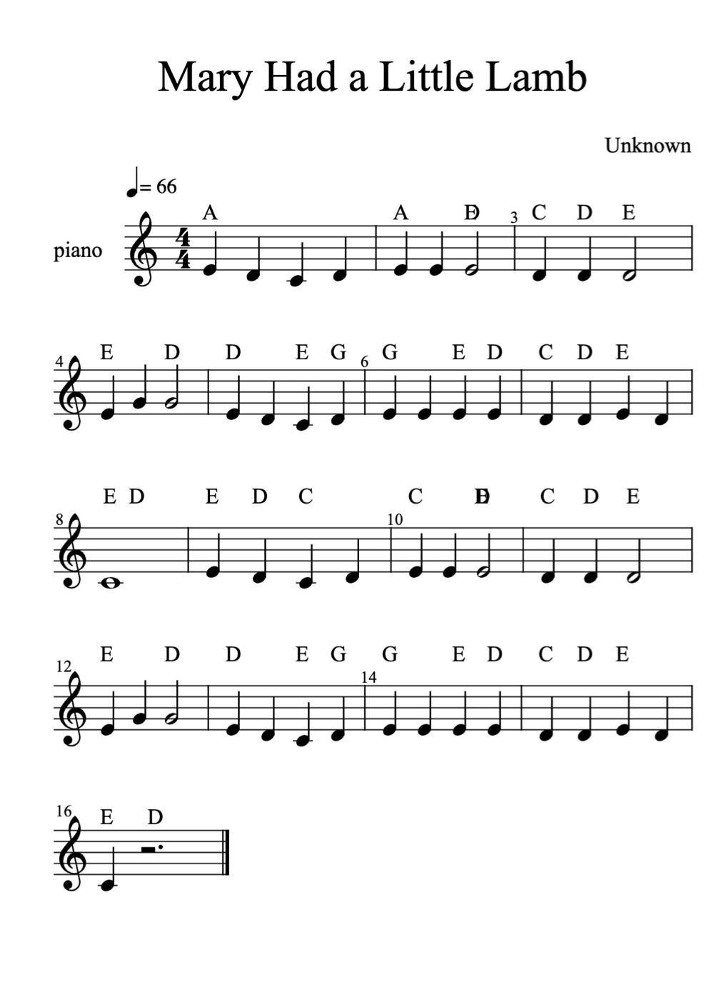

Audio-to-sheet-music transcription for simple melodies, with experimental polyphonic piano support.

## Overview

**Base models**

- [pYIN](https://librosa.org/doc/latest/generated/librosa.pyin.html) for monophonic pitch estimation
- [Basic Pitch](https://github.com/spotify/basic-pitch) for polyphonic transcription
- optional [Demucs](https://github.com/adefossez/demucs) piano isolation

**Custom pipeline**

- onset and RMS-attack detection
- tempo-aware segmentation and minimum note duration
- median pitch smoothing and octave-error correction
- fallback spectral pitch tracking
- note-event post-processing (reattack splits, gap bridging)
- key estimation and music21 score generation
- mir_eval benchmark vs a raw pYIN baseline

pYIN and Basic Pitch are the transcription engines. The rest is segmentation, post-processing, score building, and evaluation around them.

## Architecture

Single staff (melody):

```
Audio → pitch / onset extraction → segmentation / post-processing
     → key / rhythm inference → score generation → PDF
```

Grand staff (piano):

```
Audio → optional Demucs piano stem → Basic Pitch
     → note processing / hand split → two-staff score → PDF
```

## Demo

*Mary Had a Little Lamb* — single staff, 90 BPM, detected key **C major**

**Input:** [mary-had-a-little-lamb.mp3](docs/demo/mary-had-a-little-lamb.mp3)

| Pitch detection | Sheet music |
|---|---|
|  |  |

**Output:** [mary-had-a-little-lamb.pdf](docs/demo/mary-had-a-little-lamb.pdf)

## Evaluation

Same eight-note phrase at 60–180 BPM, scored with mir_eval note-level F1. Baseline is raw pYIN (adjacent pitch frames collapsed, no onset post-processing). Full tables: [docs/EVALUATION.md](docs/EVALUATION.md).

| Tempo | Raw pYIN F1 | Pipeline F1 |
|------:|------------:|------------:|
| 60 | 0.800 | 1.000 |
| 90 | 0.778 | 1.000 |
| 120 | 0.857 | 1.000 |
| 150 | 0.857 | 0.875 |
| 180 | 0.857 | 0.933 |

Average F1: **0.830 → 0.962** (~16% relative). Perfect through 120 BPM; drops at 150–180.

Polyphony is evaluated separately (Basic Pitch, grand staff). Two-note harmony F1 ranges 0.58–0.86; chords 0.64–0.87, both tempo-dependent.

The controlled set is **synthetic sine tones**, not real recordings. Basic Pitch thresholds are lowered for that fixture.

## Known limitations

- Best on clean, simple monophonic melodies
- Accuracy falls on rapid passages
- Polyphonic / grand-staff transcription is experimental
- Dense chords can miss tones or add extras
- The tempo benchmark does not measure timbre, noise, sustain, vibrato, or expressive timing

## Run locally

**Prerequisites:** Python 3.11+, Node 20+

```bash
make setup      # once
make backend    # terminal 1 → http://localhost:8000
make frontend   # terminal 2 → http://localhost:3000
```

**Optional — isolate piano from mixed audio:**
```bash
source .venv/bin/activate && pip install -r requirements-ml.txt
brew install ffmpeg   # if needed
```
Then check "Isolate piano" in the UI (Grand staff mode).

## Tests

```bash
make test    # unit + baseline tests
make eval    # MIR evaluation report → docs/EVALUATION.md
```

## License

Apache 2.0 components: [Spotify Basic Pitch](https://github.com/spotify/basic-pitch).
