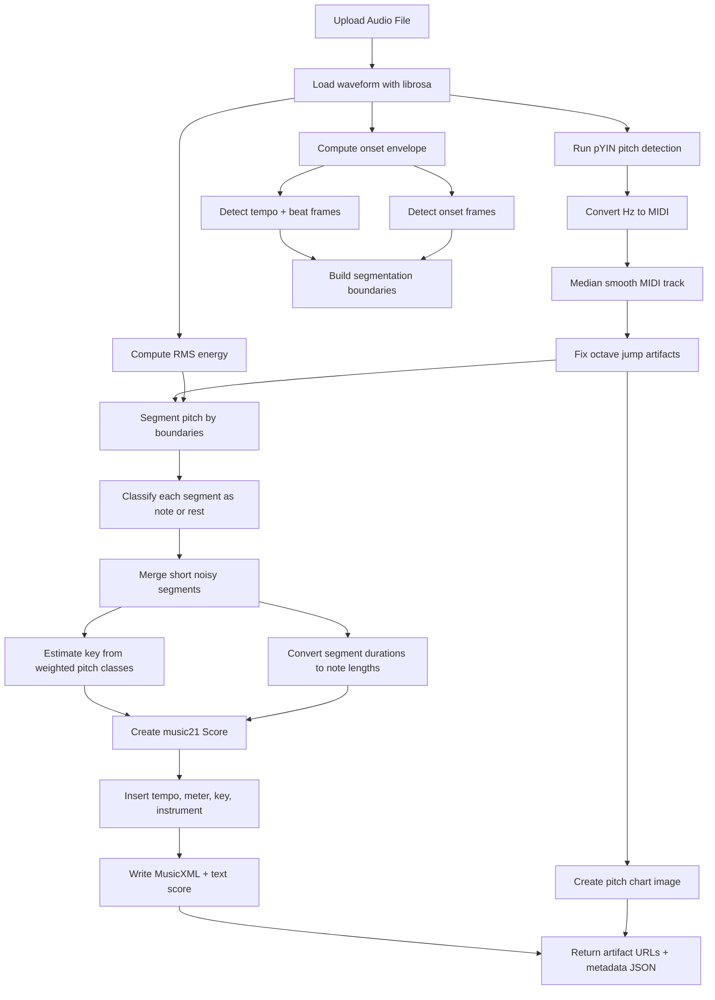

# Audio-to-Sheet Pipeline Flow

## Notes

- **Rests** come from low-energy / low-confidence pitch segments.
- **Tempo** comes from beat tracking with fallback to user tempo input.
- **Key** is estimated by weighted pitch-class matching over major keys.
- **Rhythm** is quantized to a sixteenth-note grid for cleaner notation.
